# Autonomous Drone Mission Control System & Web GCS

[](https://docs.ros.org/en/jazzy/)
[](https://px4.io/)
[](https://github.com/mavlink/mavros)
[](https://react.dev/)
[](https://tailwindcss.com/)
[](https://www.docker.com/)
[](LICENSE)

An end-to-end autonomous unmanned aerial vehicle (UAV) mission control system and web-based Ground Control Station (GCS). Developed as a senior graduation project, this repository delivers robust autonomous waypoint navigation via **ROS 2 Jazzy**, **PX4 Autopilot (MAVROS)**, and a modern **React + Vite** web interface over WebSocket (`rosbridge_suite`).

---

## Flight Demonstration

<div align="center">
  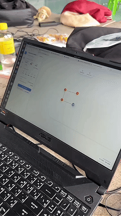
  <p><em>Figure: Real-world field flight test demonstrating autonomous multi-waypoint navigation using the Web GCS and ROS 2 Jazzy offboard mission controller.</em></p>
</div>

---

## Table of Contents

- [Overview](#overview)
- [Key Features](#key-features)
- [System Architecture](#system-architecture)
  - [1. End-to-End System Overview](#1-end-to-end-system-overview)
  - [2. Hardware & Power Distribution Block Diagram](#2-hardware--power-distribution-block-diagram)
  - [3. Companion Computer to FCU Physical Pinout](#3-companion-computer-to-fcu-physical-pinout)
  - [4. Software & Container Layered Architecture](#4-software--container-layered-architecture)
  - [5. Companion to FCU MAVROS/MAVLink Bridge](#5-companion-to-fcu-mavrosmavlink-bridge)
  - [6. Network & RF Communication Architecture](#6-network--rf-communication-architecture)
  - [7. Finite State Machine (FSM) Lifecycle](#7-finite-state-machine-fsm-lifecycle)
- [Web Ground Control Station (GCS)](#web-ground-control-station-gcs)
  - [User Interface Overview](#user-interface-overview)
  - [Frontend Global State Management](#frontend-global-state-management)
- [Project Structure](#project-structure)
- [ROS 2 Interface & Topics](#ros-2-interface--topics)
- [Prerequisites](#prerequisites)
- [Getting Started](#getting-started)
  - [Option A: Docker Deployment (Recommended)](#option-a-docker-deployment-recommended)
  - [Option B: Native ROS 2 Jazzy Setup](#option-b-native-ros-2-jazzy-setup)
- [Web GCS Setup & Development](#web-gcs-setup--development)
- [Usage Workflow](#usage-workflow)
- [Actuator & Motor Thrust Testing](#actuator--motor-thrust-testing)
- [Configuration & Parameters](#configuration--parameters)
- [Troubleshooting & FAQs](#troubleshooting--faqs)
- [Authors & Acknowledgments](#authors--acknowledgments)

---

## Overview

Modern commercial and research drone operations require dependable offboard intelligence and intuitive ground interfaces. This project bridges low-level flight dynamics and high-level mission planning by:

1. Executing deterministic **PX4 `OFFBOARD` mode** commands through an explicit Finite State Machine (FSM).
2. Facilitating bidirectional telemetry and command delivery between companion computers and flight controllers via MAVROS and `rosbridge_suite`.
3. Providing an interactive Web Ground Control Station (GCS) featuring real-time GPS map waypoint planning, WGS-84 to local ENU coordinate transformations, safety slide-to-confirm interlocks, and live flight telemetry.

---

## Key Features

### 1. Autonomous Offboard Flight Control (`mission_control.py`)

- **State Machine Architecture**: Deterministic transitions: `IDLE` $\rightarrow$ `ARMING` $\rightarrow$ `TAKEOFF` $\rightarrow$ `WAIT_CONFIRM` $\rightarrow$ `MISSION` $\rightarrow$ `HOVER` / `AUTO.RTL`.
- **Ramped Altitude Takeoff**: Eliminates aggressive altitude overshoot by gradually elevating target setpoints.
- **Smart Waypoint Heading**: Computes dynamic bearing angles toward the next target or respects designated fixed yaw headings.
- **Configurable Tolerances**: Enforces 3D position error checks ($\le 0.25\text{ m}$ horizontal, $\le 0.2\text{ m}$ vertical, $\le 10^\circ$ yaw) with programmable waypoint hover durations.
- **Failsafe & RC Override Detection**: Instantly aborts offboard control if manual RC pilot takeover is detected or the vehicle is disarmed mid-flight.

### 2. Modern Web Ground Control Station (`my_drone_pkg/www`)

- **Interactive Leaflet Mapping**: Point-and-click waypoint creation, individual altitude adjustment, path visualization, and drone location marker with real-time compass heading orientation.
- **Flight Dashboard & HUD**: Real-time instruments for ground speed, barometric/GPS altitude, battery percentage with adaptive color alerting, flight duration timer, and subsystem health indicators (GPS Fix, FCU, WiFi, GCS, Arming).
- **Coordinate Conversion Utility**: Converts global GPS waypoints (WGS-84 Latitude/Longitude) to local tangent plane (East-North-Up / ENU) coordinates referenced to the drone's initial home position.
- **Safety Slide-to-Confirm**: Prevents accidental triggers for critical flight commands (Arm, Takeoff, Proceed to Waypoint, Land, RTL, Abort).

### 3. Actuator Test Utility (`test_actuator.py`)

- Safely validates ESC response, motor spinning directions, and attitude control in offboard mode with automated Ramp-Up $\rightarrow$ Steady Hover $\rightarrow$ Ramp-Down Landing cycles (without propellers).

### 4. Containerized Companion Stack

- Pre-built with **Docker** and **Docker Compose** on `ros:jazzy-ros-base` with GeographicLib datasets, MAVROS, and `rosbridge_server` ready for hardware deployment (e.g., Raspberry Pi 4/5, NVIDIA Jetson).

---

## System Architecture

### 1. End-to-End System Overview

The overall system architecture connects the physical quadcopter, ground telemetry, and user interfaces into an integrated autonomous workflow:

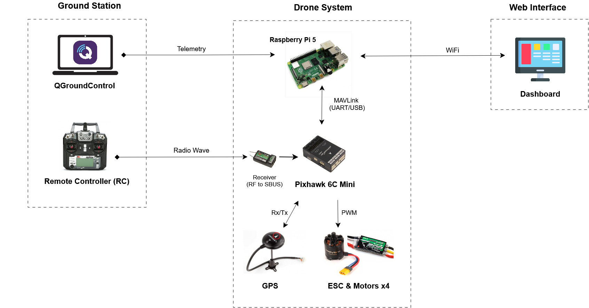

The platform is structured into three main subsystems:

- **Ground Station**: Provides direct pilot manual override through an RC transmitter (FlySky with RF-to-SBUS receiver) and optional high-level monitoring via QGroundControl over 433 MHz Telemetry Radio / Wi-Fi.
- **Drone System (S500 Quadcopter Frame)**: Equipped with a **Raspberry Pi 5** companion computer running ROS 2 Jazzy and MAVROS, communicating via high-speed UART with a **Pixhawk 6C Mini** Flight Controller Unit (FCU). The FCU controls 4 ESCs & brushless motors, with positioning assisted by a high-precision GPS/Compass module.
- **Web Interface (GCS)**: A browser-based ground station communicating bidirectionally with the companion computer via WebSockets over local Wi-Fi or Internet.

---

### 2. Hardware & Power Distribution Block Diagram

The drone hardware uses isolated power rails to prevent electrical noise and brownouts under heavy compute and motor loads:

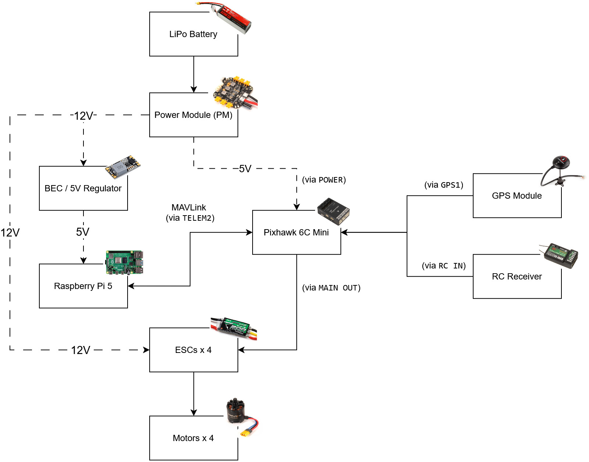

- **Primary Power Source**: 3S/4S LiPo battery supplying power through the Power Module (PM).
- **Voltage Regulation & Isolation**:
  - The Power Module supplies a regulated 5V rail directly to the Pixhawk 6C Mini (`POWER` port) while passing main battery voltage (~12V) through the power bus.
  - A dedicated **5V BEC (Battery Eliminator Circuit)** regulator steps down ~12V to clean 5V power for the Raspberry Pi 5 companion computer, protecting it from high-drain motor voltage drops.
  - The ~12V bus powers 4x Electronic Speed Controllers (ESCs) driving the brushless motors.
- **Signal & Interconnect Routing**:
  - Pixhawk 6C Mini `MAIN OUT` generates 4-channel PWM signals to control ESC motor speeds.
  - `GPS1` port connects to the external GPS and magnetometer module.
  - `RC IN` connects to the SBUS receiver for pilot safety takeover.
  - `TELEM2` provides full-duplex MAVLink serial communication with the Raspberry Pi 5.

---

### 3. Companion Computer to FCU Physical Pinout

The Raspberry Pi 5 connects directly to the Pixhawk 6C Mini `TELEM2` port via a JST-GH 6-pin to Dupont GPIO connection:

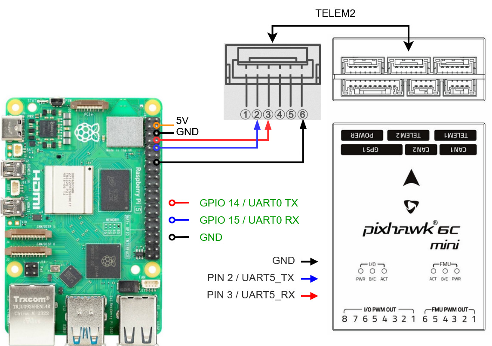

| Raspberry Pi 5 Header           | Diagram Color | Pixhawk 6C Mini `TELEM2`      | Signal Description                           |
| :------------------------------ | :------------ | :---------------------------- | :------------------------------------------- |
| **Pin 8 (GPIO 14 / UART0 TX)**  | Red           | **Pin 3 (UART5_RX)**          | Companion Transmit $\rightarrow$ FCU Receive |
| **Pin 10 (GPIO 15 / UART0 RX)** | Blue          | **Pin 2 (UART5_TX)**          | FCU Transmit $\rightarrow$ Companion Receive |
| **Pin 6 (GND)**                 | Black         | **Pin 6 (GND)**               | Common Signal Ground                         |
| **External BEC / Power Rail**   | N/A (Omitted) | **Pin 1 (VCC 5V - Optional)** | Dedicated 5V / 3A+ Power Rail                |

> [!NOTE]
> **Important Note on Wiring & Diagram Colors:**
>
> - **Signal-Focused Diagram**: The pinout diagram above specifically illustrates the UART serial communication lines (TX/RX) and Common Ground connection between the Raspberry Pi 5 and Pixhawk 6C Mini.
> - **Color Coding**: The wire colors (Red, Blue, Black) in this diagram represent the physical jumper wires used for communication signals—they do **not** follow the standard Pixhawk JST-GH color convention (where Pin 1 VCC is typically red).
> - **Power Isolation**: The 5V supply pin (Pin 1) of the FCU `TELEM2` port is intentionally left disconnected from the Raspberry Pi 5 to prevent back-powering, ground loops, or power instability. The Raspberry Pi 5 requires a dedicated, isolated external BEC (5V / 5A) power source to operate reliably under full CPU loads.
> - **Serial Configuration**: Ensure serial hardware UART is enabled on the Raspberry Pi 5 (`/dev/ttyAMA0` or `/dev/serial0`) and configured with a matching baud rate (typically `57600` or `921600` baud set in PX4 parameter `SER_TEL2_BAUD`).

---

### 4. Software & Container Layered Architecture

All companion computer software components are containerized for reproducible execution on ARM64 single-board computers:

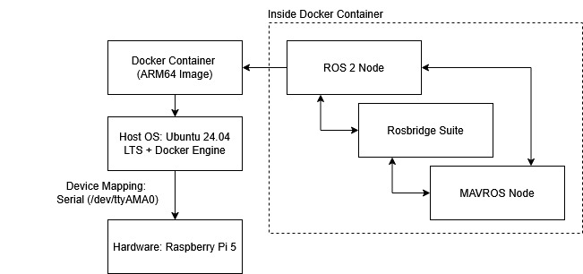

- **Hardware Layer**: Raspberry Pi 5 single-board computer.
- **Host Operating System**: Ubuntu 24.04 LTS with Docker Engine and hardware device mapping (`/dev/ttyAMA0` or `/dev/ttyACM0`).
- **Inside Docker Container (`drone_jazzy`)**:
  - **MAVROS Node**: Handles low-level MAVLink protocol translation, publishing standard ROS 2 topics and exposing control services.
  - **Rosbridge Suite**: Bridges ROS 2 topics and services to JSON over WebSocket on port `9090`.
  - **Offboard Control Node (`mission_control.py`)**: Runs the autonomous state machine and calculates setpoints.

---

### 5. Companion to FCU MAVROS/MAVLink Bridge

Communication between ROS 2 algorithms and the flight controller hardware is bridged bidirectionally through MAVROS:

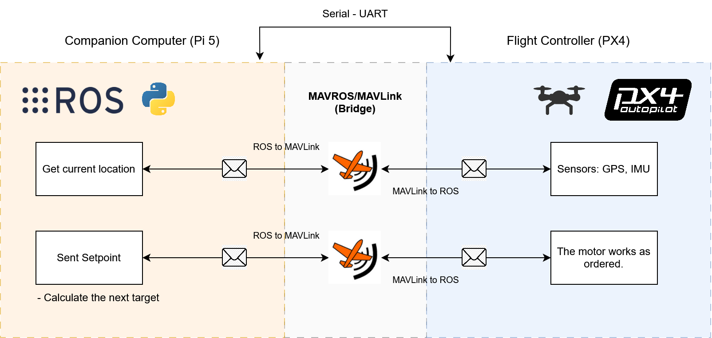

- **Downlink (Telemetry & State Estimation)**:
  - Flight sensors (GPS, IMU, Barometer) publish high-rate MAVLink messages over Serial UART.
  - MAVROS converts incoming MAVLink packets into standard ROS 2 messages (`sensor_msgs/msg/NavSatFix`, `geometry_msgs/msg/PoseStamped`, `mavros_msgs/msg/State`) ingested by `mission_control.py`.
- **Uplink (Control & Setpoint Streaming)**:
  - The offboard mission node computes desired 3D position setpoints (`geometry_msgs/msg/PoseStamped`).
  - MAVROS serializes position commands into MAVLink `SET_POSITION_TARGET_LOCAL_NED` packets, which the PX4 position controller tracks to drive the motors.

---

### 6. Network & RF Communication Architecture

Telemetry and control commands flow over both Wi-Fi and independent RF radio links for redundancy:

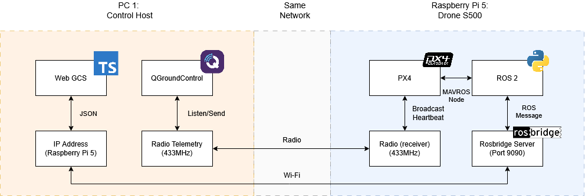

- **Local Wi-Fi Network**: Connects the Control Host (running Web GCS) to the Raspberry Pi 5 (running `rosbridge_websocket` on port `9090`) to stream real-time JSON telemetry and send waypoint commands.
- **Radio Telemetry (433 MHz)**: Establishes a secondary, long-range RF telemetry link between QGroundControl and the Pixhawk autopilot for heartbeat broadcasting and parameter calibration.

---

### 7. Finite State Machine (FSM) Lifecycle

The autonomous flight sequence is orchestrated by a deterministic Finite State Machine implemented in `mission_control.py`:

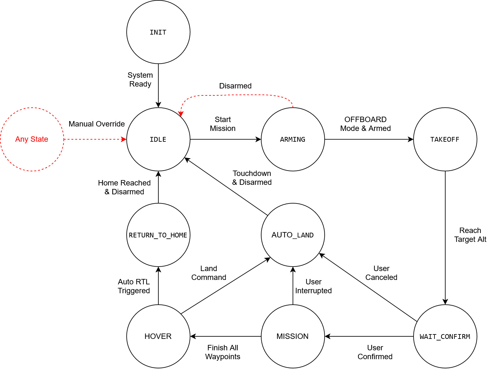

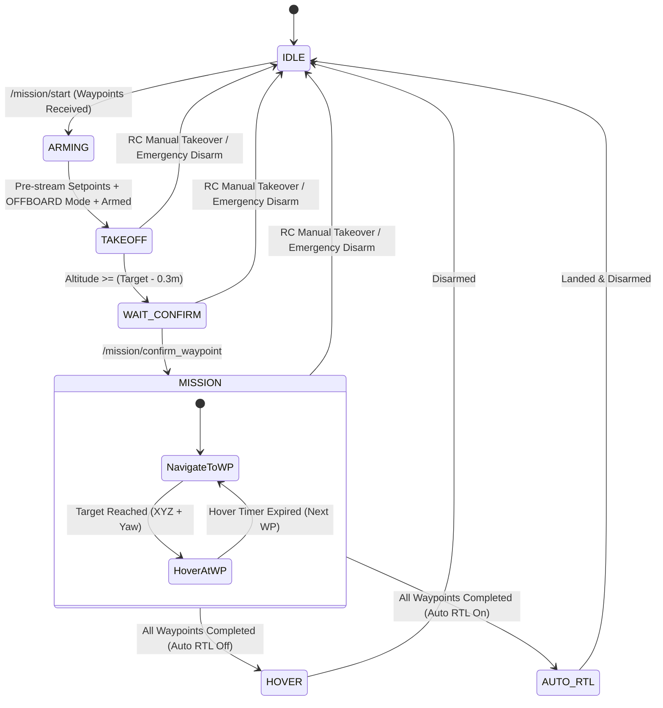

- **`INIT` $\rightarrow$ `IDLE`**: Drone initializes sensors and awaits mission waypoint submission.
- **`IDLE` $\rightarrow$ `ARMING`**: Triggered by `/mission/start`. Pre-streams setpoints at 20 Hz to satisfy PX4 requirements, switches to `OFFBOARD` mode, and arms motors.
- **`ARMING` $\rightarrow$ `TAKEOFF`**: Linearly ramps target altitude to the user-specified height.
- **`TAKEOFF` $\rightarrow$ `WAIT_CONFIRM`**: Reaches target altitude ($\pm 0.3\text{ m}$) and hovers, awaiting user permission.
- **`WAIT_CONFIRM` $\rightarrow$ `MISSION`**: Triggered by `/mission/confirm_waypoint` from the Web GCS.
- **`MISSION` Execution**: Iterates through waypoints, orienting heading toward the target and hovering for the configured duration at each waypoint.
- **Completion (`HOVER` / `AUTO.RTL`)**: Either hovers at the last waypoint or triggers Return-to-Launch (`AUTO.RTL`).
- **Failsafe Interrupt**: Any manual RC transmitter stick input or disarm immediately aborts offboard control and returns to `IDLE` or `AUTO_LAND`.

---

## Web Ground Control Station (GCS)

### User Interface Overview

The web ground station is divided into two primary operating modes: **Flight Dashboard** and **Mission Planner**.

#### 1. Mission Planner (`/planner`)

The Mission Planner allows operators to visually draft complex autonomous flight paths by clicking directly on an interactive map:

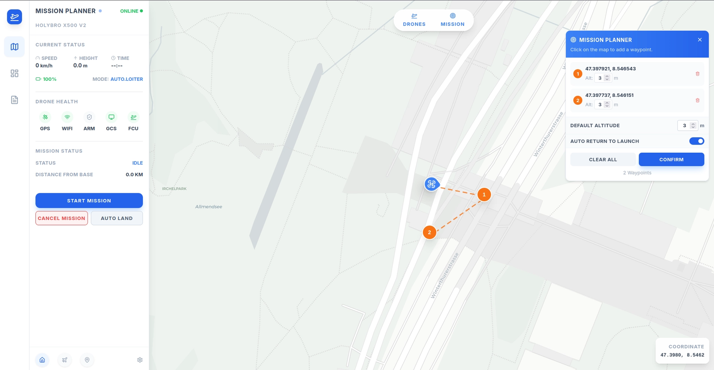

- **Waypoint Planning Drawer**: Lists all drafted waypoints with coordinates and allows setting per-waypoint altitudes.
- **Safety Options**: Set default altitude, toggle Auto Return to Launch (Auto RTL) upon mission completion, and clear or confirm paths.
- **Safety Slide-to-Confirm**: High-stakes flight commands (`Start Mission`, `Cancel Mission`, `Auto Land`) require a positive sliding gesture to prevent accidental triggering.

#### 2. Flight Dashboard (`/`)

The Dashboard provides real-time situational awareness with an integrated flight telemetry HUD, live map tracking, altitude history charts, and quick-action flight safety controls:

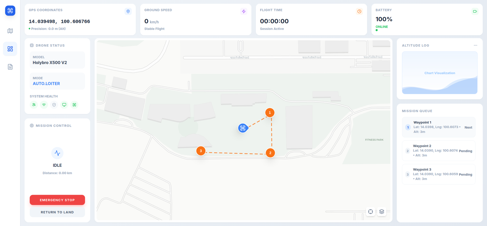

- **Telemetry HUD**: Displays GPS Coordinates, Ground Speed, Active Flight Session Timer, and Battery Percentage with dynamic color warnings.
- **Status Panel**: Displays flight mode (e.g. `AUTO.LOITER`, `OFFBOARD`), vehicle frame model, and hardware health badges (GPS, WiFi, ARM, GCS, FCU).
- **Map View & Mission Queue**: Real-time Leaflet map tracking the vehicle's position, heading orientation, and upcoming waypoints in the queue.

---

### Frontend Global State Management

The frontend utilizes React 19 Context API for predictable, reactive global state:

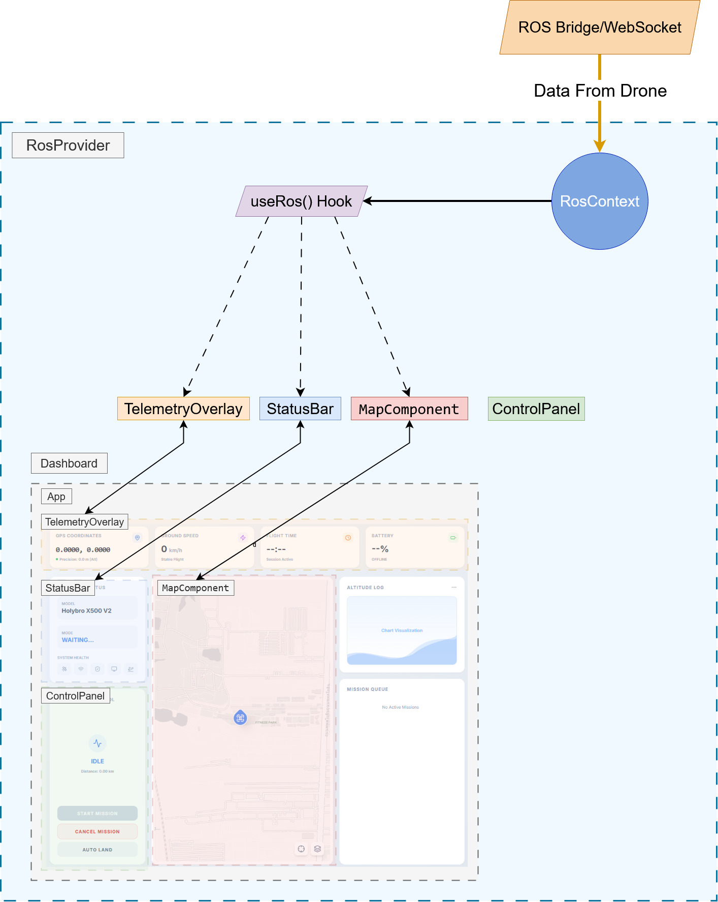

- **`RosProvider` (`RosContext.tsx`)**: Manages the core WebSocket connection (`ROSLIB.Ros`), subscribes to MAVROS state and telemetry topics, and provides service invocation wrappers.
- **`useRos()` Custom Hook**: Provides reactive telemetry (speed, altitude, battery percentage, compass heading, flight timer, health status) to child components.
- **Subscribed UI Components**:
  - `TelemetryOverlay`: Renders real-time flight instruments.
  - `StatusBar`: Shows flight mode, arming state, and subsystem communication health.
  - `MapComponent`: Leaflet interactive map rendering live drone GPS coordinates and heading orientation.
  - `ControlPanel`: Action triggers equipped with safety slide-to-confirm modals.

---

## Project Structure

```text
drone-autonomous-project/
├── .vscode/                     # VS Code workspace settings
├── doc/
│   └── images/                  # Architecture, wiring, UI, and FSM diagrams
│       ├── flight_test_demo.gif
│       ├── system_overview_diagram.jpg
│       ├── hardware_power_block_diagram.png
│       ├── rpi5_pixhawk_pinout_connection.png
│       ├── docker_layered_architecture.jpg
│       ├── mavros_mavlink_bridge_diagram.png
│       ├── gcs_drone_communication_diagram.png
│       ├── mission_fsm_diagram.png
│       ├── web_gcs_dashboard_ui.png
│       ├── web_gcs_mission_planner_ui.png
│       ├── web_gcs_state_management.jpg
│       ├── waypoint_transmission_verification.png
│       └── settings_sync_verification.png
├── Dockerfile                   # Multi-stage ROS 2 Jazzy container definition
├── docker-compose.yml           # Hardware device passthrough & network runtime
├── README.md                    # Project documentation
└── src/
    └── my_drone_pkg/            # Main ROS 2 package
        ├── package.xml          # Package dependencies and metadata
        ├── setup.py             # Python packaging and console entry points
        ├── setup.cfg            # Script installation configurations
        ├── config/
        │   ├── px4_config.yaml  # MAVROS plugin settings and covariance tolerances
        │   └── px4_pluginlists.yaml # Active/inactive MAVROS plugin lists
        ├── launch/
        │   └── drone_mission.launch.py # Master launch file (MAVROS + FSM + Rosbridge)
        ├── my_drone_pkg/
        │   ├── __init__.py
        │   ├── mission_control.py      # Core FSM offboard mission controller
        │   ├── test_actuator.py        # Safe motor spin & thrust testing script
        │   └── mission_control_old.py  # Reference legacy controller
        └── www/                         # Web Ground Control Station (GCS)
            ├── index.html
            ├── package.json             # React 19, Leaflet, ROSLIB, Tailwind CSS
            ├── vite.config.ts           # Vite development and bundle configuration
            └── src/
                ├── components/          # DroneMap, HealthIndicators, Modals, etc.
                ├── contexts/            # RosContext, MissionContext, SettingsContext
                ├── pages/               # DashboardPage, MissionPlannerPage
                └── types/               # TypeScript interfaces
```

---

## ROS 2 Interface & Topics

### Published Topics

| Topic                             | Type                             | Rate  | Description                                                      |
| :-------------------------------- | :------------------------------- | :---- | :--------------------------------------------------------------- |
| `/mavros/setpoint_position/local` | `geometry_msgs/msg/PoseStamped`  | 20 Hz | Desired 3D position and orientation sent to PX4 in OFFBOARD mode |
| `/mavros/setpoint_raw/attitude`   | `mavros_msgs/msg/AttitudeTarget` | 20 Hz | Used by `test_actuator` for motor throttle and attitude tests    |

### Subscribed Topics

| Topic                            | Type                            | Source  | Description                                                     |
| :------------------------------- | :------------------------------ | :------ | :-------------------------------------------------------------- |
| `/mavros/state`                  | `mavros_msgs/msg/State`         | MAVROS  | Current flight mode, arming status, and FCU connection          |
| `/mavros/local_position/pose`    | `geometry_msgs/msg/PoseStamped` | MAVROS  | Real-time drone position & orientation in the local ENU frame   |
| `/mavros/global_position/global` | `sensor_msgs/msg/NavSatFix`     | MAVROS  | WGS-84 GPS coordinates (latitude, longitude, altitude)          |
| `/mavros/home_position/home`     | `mavros_msgs/msg/HomePosition`  | MAVROS  | GPS fix recorded as reference home origin                       |
| `/mission/waypoints`             | `geometry_msgs/msg/PoseArray`   | Web GCS | Sequence of 3D waypoints generated from the map                 |
| `/mission/settings`              | `std_msgs/msg/String`           | Web GCS | JSON configuration payload (takeoff alt, speed, hover duration) |

### Services

| Service Name                   | Type                               | Direction | Purpose                                                                  |
| :----------------------------- | :--------------------------------- | :-------- | :----------------------------------------------------------------------- |
| `/mission/start`               | `std_srvs/srv/Trigger`             | Server    | Initiates mission: transitions state from `IDLE` to `ARMING`             |
| `/mission/confirm_waypoint`    | `std_srvs/srv/Trigger`             | Server    | Confirms departure to the first waypoint after reaching takeoff altitude |
| `/mavros/cmd/arming`           | `mavros_msgs/srv/CommandBool`      | Client    | Arms / Disarms the drone motors                                          |
| `/mavros/set_mode`             | `mavros_msgs/srv/SetMode`          | Client    | Sets PX4 flight modes (`OFFBOARD`, `AUTO.LOITER`, `AUTO.RTL`)            |
| `/mavros/param/set_parameters` | `rcl_interfaces/srv/SetParameters` | Client    | Dynamically adjusts PX4 flight parameters (e.g. cruise velocity)         |

---

## Prerequisites

- **Host Operating System**: Ubuntu 24.04 LTS (for native ROS 2 Jazzy) or Windows/Linux with Docker Desktop.
- **Flight Controller Hardware**: Pixhawk 6C Mini (PX4 Firmware v1.14+) connected via UART/USB.
- **Companion Computer**: Raspberry Pi 5 (8GB recommended) with active cooler.
- **Simulation Alternative**: PX4 Software-In-The-Loop (SITL) with Gazebo.
- **Node.js**: Version 18+ (for building the Web Ground Control Station).

---

## Getting Started

### Option A: Docker Deployment (Recommended)

Docker provides an isolated, pre-configured environment without requiring manual ROS 2 installation on the host:

1. **Clone the repository**:

   ```bash
   git clone https://github.com/kengmaikinpak/drone-autonomous-project.git
   cd drone-autonomous-project
   ```

2. **Configure Device Ports in `docker-compose.yml`**:
   Verify your serial telemetry device port (e.g., `/dev/ttyACM0` for USB or `/dev/ttyAMA0` for GPIO UART).

3. **Build and launch the container**:

   ```bash
   docker compose up --build
   ```

   The container will automatically compile the ROS 2 workspace (`colcon build --symlink-install`), source dependencies, and start `drone_mission.launch.py`.

---

### Option B: Native ROS 2 Jazzy Setup

If running directly on Ubuntu 24.04 LTS:

1. **Install MAVROS & Dependencies**:

   ```bash
   sudo apt-get update && sudo apt-get install -y \
       ros-jazzy-mavros \
       ros-jazzy-mavros-extras \
       ros-jazzy-rosbridge-suite \
       python3-pip \
       wget

   # Install required GeographicLib datasets for GPS coordinate frames
   wget https://raw.githubusercontent.com/mavlink/mavros/master/mavros/scripts/install_geographiclib_datasets.sh
   sudo bash ./install_geographiclib_datasets.sh
   rm install_geographiclib_datasets.sh
   ```

2. **Build the ROS 2 Workspace**:

   ```bash
   cd ~/drone-autonomous-project
   source /opt/ros/jazzy/setup.bash
   colcon build --symlink-install
   source install/setup.bash
   ```

3. **Run the Master Launch File**:
   - **For Physical Drone (UART / USB Serial)**:
     ```bash
     ros2 launch my_drone_pkg drone_mission.launch.py fcu_url:=/dev/ttyAMA0:921600
     ```
   - **For PX4 SITL Simulation (Localhost UDP)**:
     ```bash
     ros2 launch my_drone_pkg drone_mission.launch.py fcu_url:=udp://:14540@127.0.0.1:14557
     ```
   - **With QGroundControl Telemetry Forwarding**:
     ```bash
     ros2 launch my_drone_pkg drone_mission.launch.py gcs_url:=udp://@<GCS_HOST_IP>:14550
     ```
     **Note on IP Address (`<GCS_HOST_IP>`)**:
     - Replace `<GCS_HOST_IP>` with the actual IP address of the Ground Station computer or laptop running QGroundControl (e.g. `udp://@192.168.1.100:14550`).
     - This allows MAVROS on the drone to forward MAVLink telemetry packets over UDP port `14550` (the standard QGC listening port) across the Wi-Fi network, enabling simultaneous monitoring on QGroundControl alongside the Web GCS.
     - If running QGroundControl on the same machine (e.g., in simulation), use `udp://@127.0.0.1:14550` or leave the default `udp://@`.

---

## Web GCS Setup & Development

The Web Ground Control Station runs independently and communicates with ROS 2 via WebSocket on port `9090`.

1. **Navigate to the web project directory**:

   ```bash
   cd src/my_drone_pkg/www
   ```

2. **Install frontend dependencies**:

   ```bash
   npm install
   ```

3. **Start the local development server**:

   ```bash
   npm run dev
   ```

4. **Access the GCS**:
   Open your browser and navigate to `http://localhost:5173`.
   - Configure the ROS WebSocket URL in the top navbar (default: `localhost:9090` or your companion computer IP, e.g., `192.168.1.50:9090`).

---

## Usage Workflow

Follow these steps for a complete autonomous mission:

```text
[ Connect GCS & Drone ] ──> [ Plan Mission Waypoints ] ──> [ Send Mission to ROS ]
                                                                     │
[ Disarm / Mission Done ] <── [ Auto RTL / Hover ] <── [ Execute ] <─┘
```

1. **Connect & Telemetry Verification**:
   - Verify all health indicators display green (FCU, GPS 3D Fix, GCS, and WiFi).
2. **Configure Flight Parameters**:
   - Click the **Settings** icon to configure:
     - Takeoff Altitude (Default: `3.0 m`)
     - Cruise Speed (Default: `5.0 m/s`)
     - Waypoint Hover Duration (Default: `5.0 s`)
     - Auto RTL on Mission Completion (`True` / `False`)
3. **Plan Waypoints in Mission Planner**:
   - Navigate to the **Mission Planner** page (`/planner`).
   - Toggle **Add Waypoints** mode and click locations on the map.
   - Adjust individual waypoint altitudes if required.
   - Click **Send Mission to Drone**. The web client translates global coordinates into local ENU offsets and transmits them to `/mission/waypoints`.
4. **Execute Autonomous Flight**:
   - Return to the **Dashboard** (`/`).
   - Slide **START MISSION**. The drone will arm, switch to `OFFBOARD` mode, and ascend smoothly to the takeoff altitude.
   - Once stable at takeoff altitude, the status updates to `WAITING CONFIRM`.
   - Slide **GO TO WAYPOINT** to command the drone to start navigating through the waypoint sequence.
5. **In-Flight Safety Actions**:
   - **Hold / Loiter**: Slide **CANCEL MISSION** to instantly halt motion and maintain current position (`AUTO.LOITER`).
   - **Emergency Land**: Slide **AUTO LAND** to initiate immediate descent (`AUTO.LAND`).
   - **Manual Override**: Switching any flight mode switch on the manual RC transmitter instantly yields control to the pilot.

---

## Actuator & Motor Thrust Testing

To safely verify ESC calibration and motor rotation direction on the bench:

> [!CAUTION]
> **ALWAYS REMOVE PROPELLERS** before conducting actuator or motor spin tests indoors or on the bench.

Run the actuator test node:

```bash
ros2 run my_drone_pkg test_actuator
```

**Test Stages**:

1. **Streaming Setpoints**: Streams zero-thrust attitude setpoints at 20 Hz.
2. **Arm & Offboard Switch**: Automatically arms and engages `OFFBOARD` mode.
3. **Ramp-Up (5s)**: Gradually ramps motor thrust up to test hover thrust (`0.74`).
4. **Hold (5s)**: Maintains steady thrust for 5 seconds.
5. **Ramp-Down (10s)**: Linearly ramps thrust down to zero.
6. **Disarm**: Automatically disarms motors upon test completion.

---

## Configuration & Parameters

### MAVROS Parameters (`config/px4_config.yaml`)

- **System Rate**: Heartbeat frequency set to 1.0 Hz; timesync active at 10.0 Hz.
- **Coordinate Reference**: `frame_id: "map"`, `child_frame_id: "base_link"`.
- **Altitude Handling**: `use_relative_alt: true` ensures altitude reads relative to takeoff ground level rather than mean sea level (MSL).

### Launch Arguments (`launch/drone_mission.launch.py`)

- `fcu_url`: Connection string for the flight controller:
  - Serial: `/dev/ttyACM0:57600` or `/dev/ttyAMA0:921600`
  - UDP SITL: `udp://:14540@127.0.0.1:14557`
- `gcs_url`: Optional bridge target to stream MAVLink telemetry to QGroundControl (`udp://@<GCS_HOST_IP>:14550` where `<GCS_HOST_IP>` is the IP address of the GCS computer). Default: `udp://@`.

---

## Troubleshooting & FAQs

### 1. FCU will not switch to OFFBOARD mode

- **Cause**: PX4 requires an active stream of setpoints for at least 1 second before permitting an offboard mode switch.
- **Resolution**: `mission_control.py` streams 40 cycles (~2 seconds) of setpoints before requesting offboard mode. Ensure the node is running before attempting to switch modes.

### 2. Disarming occurs immediately upon arming

- **Cause**: PX4 safety checks (e.g., GPS lock absent or compass interference).
- **Resolution**: Check QGroundControl or the health indicator bar to verify GPS lock (Fix $\ge 3$) and ensure pre-arm checks pass.

### 3. Web Dashboard displays "Offline"

- **Cause**: The `rosbridge_websocket` node is not running or the IP is incorrect.
- **Resolution**: Check that port 9090 is accessible (`netstat -tuln | grep 9090`). In the Web UI settings, verify the target URL is formatted as `ws://<companion_ip>:9090`.

### 4. Permission denied on `/dev/ttyACM0` or `/dev/ttyAMA0`

- **Cause**: Missing dialout group permissions on the Linux host.
- **Resolution**:
  ```bash
  sudo usermod -aG dialout $USER
  ```
  _(Log out and back in for changes to take effect)._

---

## Authors & Acknowledgments

This project was developed as a Senior Engineering Capstone Project at Bangkok University by:

- **Apisit Suansane** (Lead Developer) - [@kengmaikinpak](https://github.com/kengmaikinpak)
- **Anantachai Mingkhwan** - [@Ear-z](https://github.com/Ear-z)
- **Amarin Phola** - [@amarinphol-blip](https://github.com/amarinphol-blip)
- **Naparut Kaomoon** - [@naparutkaomoon](https://github.com/naparutkaomoon)
- **Thanakirt Kaewkhiaw** - [@Tnk2202](https://github.com/Tnk2202)

### Frameworks & Libraries

- [PX4 Autopilot](https://px4.io/)
- [ROS 2 Jazzy Jalisco](https://docs.ros.org/en/jazzy/)
- [MAVROS](https://github.com/mavlink/mavros)
- [Robot Web Tools (rosbridge / roslibjs)](http://robotwebtools.org/)
- [Leaflet](https://leafletjs.com/) & [Tailwind CSS](https://tailwindcss.com/)
